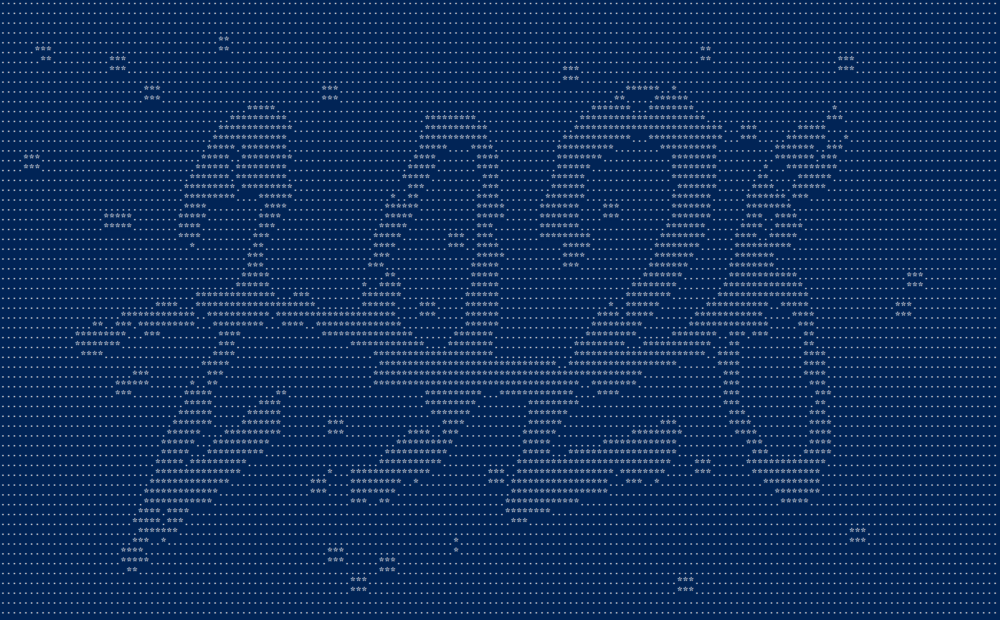
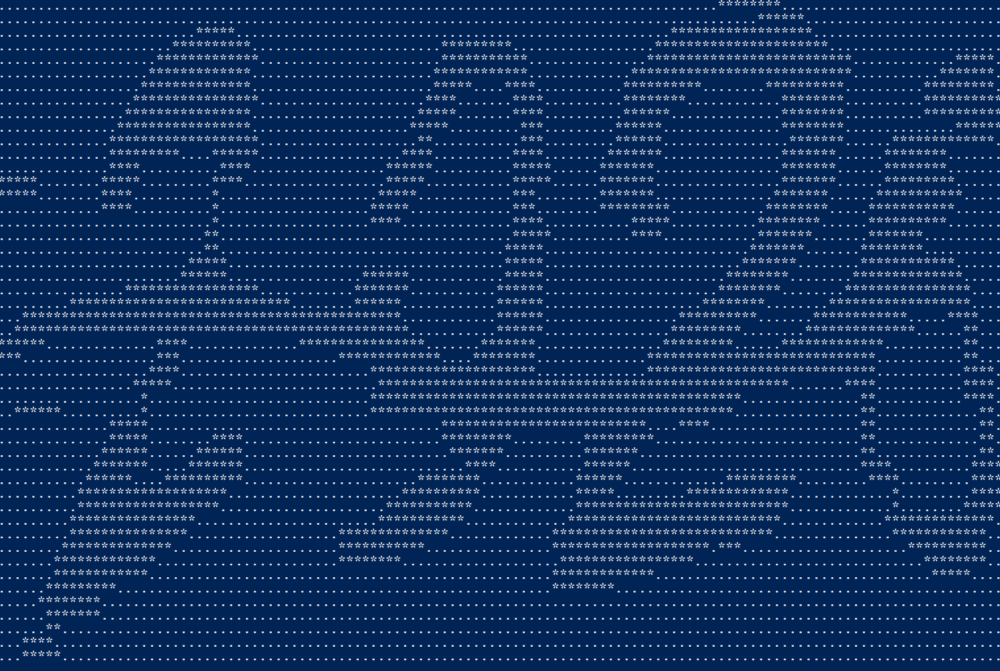

# Week 9 blog - What would I have done differently for the assignment
The main thing I would have done for the assignment is to start earlier. Additionally, I should have spent longer on deciding between a straightforward method versus a probability based method. Looking back at the assignment, my probability method was the start of creating a neural-network. However, I would have needed much more time to organize a network which would train off the metrics and statistics my metrics had produced.

Thus, maybe a simple straightforward approach could have produced better "results" (in terms of how many digits it would crack) for the timeframe that was given for the assignment. However, if the assignment were treated as a chance to simply try out new things and learn, I do not regret approaching it the way I did, as I am pleased to how the program was structured and its potential for further development.

# Finshing off the assignment with noise cleaning for challenges
Since I had based my segmenting program on probability and density, if I were to clean up the challenge captchas somewhat, the segmenting function would have a greater chance of success. The noise cleaning program I implemented simply took any horizontal line of white/black that was short than 4 in length, and checked the space above and below it. If the space above and below was off opposite color, it would flip the pixel so that it matched. This resulted in a much cleaner captcha.

Following is an image before being cleaned

Following is an image after being cleaned:

The next steps would be to remove overly long horizontal lines (ones that cross whole digits, which is obviously not part of a digit. Then after this the digits would have to be stitched back together. I would do this based on an algorithm that would search over each pixel for pixels that are equidistantly opposite, and then create a line between them to stitch the gaps in the digit. After this, the digits would be much better prepared for segmenting and cracking.

# Finished simple segmenting, improving digits again
Now I have created a simple segmenting function. It starts off by taking the bounding box of the captcha, then assuming that the splits will be at quarter distances along the box. Then it checks each assumption, and goes left and right as far as needed until there is a blank vertical line. This is then used as the partitioning line. After this its a simple matter of copying the 4 digits into an array one by one, then feeding that into the digit function. This then results in the 4 digits that are used for the guess.

Now that a simple segmenting program has been written, I know I will have to improve this later if I want it to work for the challenge captcha, since there are usually no blank lines between digits in that. I will have to use a probability based system with the density of any given line to split it.

For now, I will go back and analyze the single digit cracking for a bit longer, before I attempt the challenge captchas. The next steps for single digits will involve a lot of fine tuning as 7's 2's 3's and 1's can still sometimes get confused by a very small margin. I may consider doing a case by case analysis, where I take the 2 most likely digits, then amplify the value of the metrics that are more likely to tell those two digits apart. For example, if 7 and 2 are the most likely digits (within 5 points or so), I would look mostly at the metrics that analyze the bottom right of the image which look for the sharp fall leftwards that 2's have.

# Finshing off the digits for now...
Finally, individual digit cracking seems reasonably decent to continue on with the rest of the solution. The digits now use 25 metrics:

- Horizontal balance
- Vertical Balance
- Tallness
- Hole size fraction
- Holes
- Density
- Maximum vertical fraction
- Maximum horizontal fraction
- Average width fraction
- Middle Left density
- Bottom right density
- Vertical Position of hole
- Standard deviation of horizontal balance
- Average distance until three strokes
- Horizontal balance of top half of image
- Steepest fall over one pixel top left, bottom right, middle left
- Bottom Horizontal balance
- Deepest pixel of left bottom of image
- Vertical lines in bottom of image
- Max difference of lengths of vertical strokes on bottom half of image
- Biggest horizontal delta of bottom left, bottom right, and top right of image

These metrics probably need more evaluation and testing later.

For now, I'll move onto the captcha part of the solution.

Of course, theoretically, the captcha part is a simple extension of the digit program. The only addition feature it will need is a segmenting feature which can split up the digits horizontally. After this, the digits can be passed into the digit cracking function and an answer can be found.

# Continuing on the plan, hail Mary for some progress, and thinking ahead
Going off where I left off, I continue with another 6 metrics. These are

- Ratio of vertical position of midpoint of a hole (if one exists)
- Standard definition of horizontal balance
- Mean distance from left side until there are 3 lines intersected in that column
- Horizontal balance of the top half of the image
- Steepest slope when tracing the image from the top left
- Steepest slope when tracing the image from the bottom right

Each metric was created as I was targeting specific digits. For example, the vertical position of the hole would differentiate 6's and 9's. The deviation of the horizontal balance differentiates 7's and 1's. Horizontal Balance of the top half of the image helps separate 5's and 3's. On a note, I noticed 5's and 3's are very hard to differentiate, as they are practically the same except for the vertical line on the top half of the image being either the left or right. Hence, I created the steepest slope from top left of image. This would product a steep slope for a 3, and virtually no slope for a 5.

It was good to see that after adding these metrics, to make a total of 17 metrics, the success rates for most digits are mostly acceptable. However 3 continues to be a problem. It seems to be mostly confused with 2's and 1's. Seeing the 2's, I'll add a steepest slope for the bottom left of the image, since 2 has a smooth fall there instead of 3's sharp fall.

Somehow, through the project, 1 continues to be a problem by itself and for other digits. This is generally due to the skew, and a lack of a truly reliable metric for it. As a human, we just see 1 as a long line. It can literally be in any orientation and we'll see a 1 without too much issue, especially if it has a base and cap. Therefore, the next metric shall attempt to find the longest straight line in the image, regardless of orientation. For now, I believe this to be easier than deskewing, as deskewing would involve this process plus more.

# Analysis of progress so far, and planning ahead
After the discoveries I had made last time (that the 5 metrics + z-score technique didn't give adequate results), I had a choice to make of either more metrics, or changing the analytical method. The only other feasible analytical method I could think of was neural networks, but I decided not to try this yet because of two reasons. One, the network might become overtrained to this very limited dataset of 100 samples per digit, and not allow for enough randomness. Secondly, there will be training to be done later for the challenge captchas, and that will change the whole network. Thus, I decided to add extra metrics. The first few ideas I have currently are to find the longest vertical line as a ratio of the height, and same for the horizontal. Also, average width and density of specific regions of the image.

After adding these metrics in, the reliability visibly increased. This included distinguishing 0's more from 4's, as 0's are a fatter digit on average. Also 7's are thinner on average. The longest vertical line helped distinguish 1's, and 4's, since they clearly have a long vertical component. However, at this, stage, while analyzing some of the failures, I begin to notice that skew in the digits could be more of a problem than I thought they would be. Hence, I start to think of techniques to deskew singular digits. Of course I quickly realize this will be quite hard, so for now, I decided to continue with more metrics until I can get as high as possible reliability rates.

# Using the metric data to crack digits
The next step was to decide how to use these metrics to compile the available data and then use it in a form to guess a randomly inputted digit. I decided to simply calculate the average and standard deviation for each metric for each digit. Then by writing this to a csv file in statistics compilation mode, I can just read the data when I run the program in guessing mode. The way I use the mean and SD is by getting the z score of the unknown digit compared to every metric of every digit. Then, by adding up the z scores of it against each digit, I take the digit with the lowest z score as the guess (since this is the digit with normalized lowest deviation).

By using this technique on the previous 5 metrics that I had already written, I was disappointed to find that this only gave a success rate of 60% for non-holed digits.

# Getting started on basic metrics
After I had my flood fill algorithm, I was ready to write the first few metrics. Each metric is recorded as an entry in an enumerated type so that I could keep track of which array element holds which piece of data about the image.

Horizontal balance, vertical balance and tallness were of course straightforward.

For holes, I simply had to use my map created by my flood fill algorithm and look for islands that were isolated and white. Once I had identified these holes, I could count the holes and add up the size to find the hole size fraction.

# Getting the program set up ready for the real code
Firstly, I decided to write a few basic utility type functions. These include a set of functions to operate a stack, as a well as a flood fill algorithm. I realized that the flood fill algorithm will make it easy to identify holes, as well as their size. Furthermore, I knew that I will be able to use it further later when I need to remove noise from the image and possibly other applications.

I wrote a few other basic functions to zero out 2D arrays of int and double types, since I will use them extensively. Additionally, I wrote the program so that I could quickly test it and give specific commands to switch between different modes (test multiple digits, single digit, etc.).

# Preperation for solution development
Before I properly started on writing any types of algorithms, I decided to spend a little time setting up my workflow and the project structure so that It would be easy to extend. As standard, I wrote a makefile and moved all the files onto my local linux machine.

For the structure, I split up the program into multiple logical headers. These include preprocessers, utilities, metrics, stack, readers, and data. This will allow for more efficient coding and compiling since I can concentrate on one function at a time and easily incorporate it into the rest of the program.

# A proper first look at the digit cracking problem
The first step I took to approaching this problem was to trial with the basic metrics that were part of the lab exercises. As I was going through these exercises I thought about the different ways I could solve this problem. The first ideas that came to mind were many metrics, neural networks, or a combination.

I also started to think of different ways I could clean the image when it came to the challenge exercises. Initial ideas for this were a flood fill algorithm to identify the major regions of the picture, then simply disregarding relatively small regions (by assuming them to be noise). I also noticed broken digits. I then started to consider algorithms which could possibly rejoin/smooth out the digit.

# Assignment planning
My overall strategy for the assignment is to build metrics and predict using a probability model off it. I have also been thinking about including a neural network to learn to read the digits. This may be useful for the challenge captchas as theres noise that needs to be ignored.

The main features will be several metrics, probability processing, and possibly a neural network.

To segment the CAPTCHA's, a probability function based on density and location will be used.

There will be many, many functions. A function for each metric, functions for stacks, functions for preprocessing, functions for printing, functions for reading and functions for program control.
